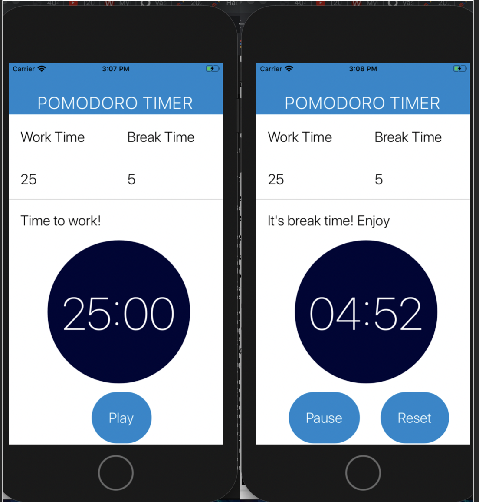

# PomodoroTimer
A simple pomodoro timer app created using React Native and JavaScript. The Pomodoro Technique is a time management method that uses a timer to break down work into intervals, traditionally 25 minutes in length, separated by short breaks of 5 minutes. 

